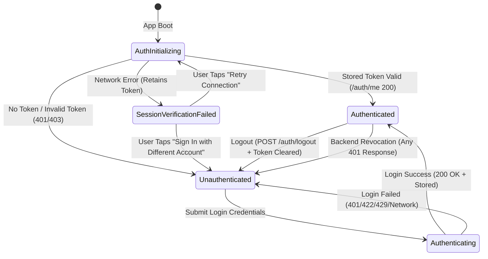

# Premium Café OS — Authentication & Secure Session Handling

## 1. Overview & Architectural Principles

Flutter Phase 2 introduces production-grade authentication and secure session handling for the **Premium Café OS** mobile and web client (`apps/mobile`).

The implementation adheres to the **Feature-First Clean Architecture** prescribed by `.agent/flutter/feature-first-flutter`:
- **Domain Layer (`features/auth/domain/`):** Pure Dart models and business rules. Completely isolated from Flutter UI, platform APIs, and HTTP libraries.
  - `StaffRole`: Strict enum (`cashier`, `manager`, `admin`) with fail-closed deserialization.
  - `AuthUser`: Immutable staff identity with permission checking (`hasPermission`).
  - `AuthSession`: Secure session entity holding user, token, and UTC expiration. Redacts Bearer tokens in `toString()`.
  - `AuthFailure`: Typed failure hierarchy representing distinct user-actionable login failure cases.
- **Data Layer (`features/auth/data/`):** DTOs, API clients, and token persistence abstraction.
  - `AuthTokenStore`: Persistent storage abstraction with platform-appropriate implementations (`SecureAuthTokenStore` and `InMemoryAuthTokenStore`).
  - `AuthApi`: Communicates with frozen backend endpoints (`POST /auth/login`, `GET /auth/me`, `POST /auth/logout`).
  - `AuthRepository`: Coordinates remote API calls, session persistence, token lifecycle, and session restoration.
- **Presentation Layer (`features/auth/presentation/`):** UI controllers and widgets.
  - `AuthController`: `ChangeNotifier` state machine enforcing single-inflight login operations.
  - `LoginPage`: Accessible, responsive login screen supporting bilingual English/Khmer typographic hierarchy, touch-friendly inputs (min 48px), and screen-reader accessibility.
  - `AuthenticatedPlaceholderPage`: Verification view proving session restoration and token encapsulation before Phase 3 App Shell navigation.

---

## 2. Session Lifecycle & State Machine



### State Definitions
1. **`AuthInitializing`:** Initial app boot state. Stored credentials are read and validated against `GET /auth/me`. Renders branded warm cream splash indicator.
2. **`Unauthenticated`:** No valid session exists. Presents `LoginPage`. If a previous login attempt failed, carries an `AuthFailure` for clear, non-technical banner display.
3. **`Authenticating`:** Login request is in-flight. Disables form submission to prevent duplicate concurrent authentication requests. Displays active button loading spinner.
4. **`Authenticated`:** Active verified session containing `AuthSession`. Grants access to application features.
5. **`SessionVerificationFailed`:** Network or server unavailability prevented validating a previously valid stored token at boot. **Security Invariant:** The stored token is *not* erased prematurely; the user is offered a "Retry Connection" button or the option to sign in with a different account.

---

## 3. Storage Security & Cross-Platform Model

### Mobile (Android & iOS)
- **Engine:** `flutter_secure_storage`
- **Android:** Hardware-backed **Android Keystore** with AES-256 GCM encryption. Keys are generated inside the Trusted Execution Environment (TEE) or StrongBox keymaster where available.
- **iOS:** **Apple Keychain Services** configured with `kSecAccessControlBiometryAny` or device passcode accessibility.

### Web (Browser Environment)
- **Design Decision:** The backend architecture utilizes JSON-formatted Bearer tokens without `HttpOnly` cookie wrappers.
- **XSS Mitigation:** Storing Bearer tokens in browser `localStorage` or `sessionStorage` exposes tokens to Cross-Site Scripting (XSS) and script extraction.
- **Policy:** Flutter Web explicitly uses `InMemoryAuthTokenStore`. Tokens are stored solely in application RAM for the duration of the browser tab. Refreshing or closing the tab cleanly terminates the session and requires re-authentication.

```dart
// Dependency Injection in app.dart
final AuthTokenStore tokenStore = kIsWeb
    ? InMemoryAuthTokenStore()
    : SecureAuthTokenStore();
```

---

## 4. Credential & Token Protection Invariants

1. **Zero Password Retention:** The user's password is used solely to construct the immediate `POST /auth/login` HTTP request body. It is never logged, never cached in memory, and never persisted to disk. Upon successful authentication, `LoginPageState` immediately calls `clear()` on the `TextEditingController`.
2. **Token Redaction in Diagnostics:** `AuthSession.toString()` explicitly redacts the Bearer token:
   ```dart
   @override
   String toString() => 'AuthSession(user: ${user.name}, role: ${user.role.value}, token: [REDACTED], expiresAt: $expiresAt)';
   ```
3. **No Sensitive Device Telemetry:** Device identification strictly adheres to privacy standards. The `device_name` submitted during login is a generic device platform label (e.g., `"Coffee POS Android"`, `"Coffee POS iOS"`, `"Coffee POS Web"`) generated via `DeviceInfo.getDeviceName()`. Hardware serial numbers, MAC addresses, and IMEIs are never collected.
4. **Fail-Closed Role Parsing:** The `StaffRole` enum accepts only `'cashier'`, `'manager'`, and `'admin'`. Unknown or malformed role strings received from the backend throw a `FormatException` rather than silently defaulting to a fallback role.

---

## 5. HTTP Error Handling & 401 vs. 403 Semantics

The client strictly differentiates between unauthenticated sessions and forbidden operations:

| Status Code | Scenario | Client Behavior |
| :--- | :--- | :--- |
| **`401 Unauthorized`** | Login request with incorrect password | Shows `AuthFailure.invalidCredentials` error banner. |
| **`401 Unauthorized`** | Stored token expired or revoked | Clears token storage, invalidates session state, and transitions app to `Unauthenticated`. |
| **`403 Forbidden`** | Account deactivated (`/auth/me` on boot) | Clears token storage and transitions to `Unauthenticated` with `AuthFailure.inactiveStaff`. |
| **`403 Forbidden`** | Normal operational endpoint permission denial | **Does NOT clear the session.** Displays access-denied snackbar/modal while keeping the staff member logged in. |
| **`422 Unprocessable`** | Malformed login payload | Parses Laravel validation dictionary into user-friendly field-level error messages. |
| **`429 Too Many Requests`** | Rate limiting triggered | Displays cooldown banner without exposing technical stack traces. |

---

## 6. Bilingual UX & Accessibility

- **Khmer & English Hierarchy:** Login card displays bilingual titles (`ប្រព័ន្ធគ្រប់គ្រងហាងកាហ្វេ` / `Coffee Management System`) formatted with safe line-height multipliers (1.35–1.45) in `AppTypography` to prevent Khmer subscript consonant clipping.
- **Physical Touch Targets:** All input fields and interactive buttons meet or exceed the mandatory 48px minimum touch height (buttons are sized at 52px).
- **Accessible Form Controls:** Password visibility toggle includes clear semantic labels (`Show password` / `Hide password`) and keyboard tab traversal is enabled via `AutofillGroup` and text input actions.
- **Responsive Layout:**
  - Compact mobile (<600px): Form expands to safe-area bounds with adaptive padding.
  - Medium / Expanded tablet (>600px): Form is contained within a centered 440px wide elevated card with warm espresso branding and subtle cream background.
