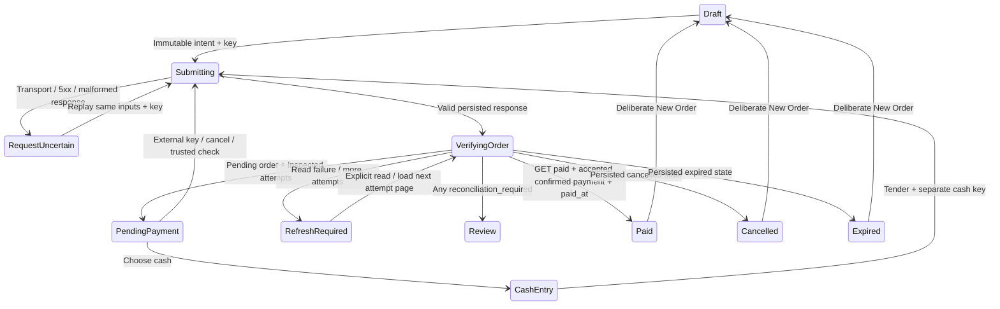

# Flutter Phase 5 — Checkout & Payment Flow

The POS now creates backend orders, settles cash, starts/checks neutral external attempts, and cancels eligible pending orders through the frozen Laravel API. Catalog/cart architecture and the existing authentication/navigation shell are retained. Production external payments remain unavailable until an approved provider is configured; this phase adds no bank/KHQR integration.

## Architecture and session lifetime

| File in `apps/mobile/lib/` | Responsibility |
| --- | --- |
| `features/pos/domain/checkout_intent.dart` | Immutable sorted product/quantity snapshot; opaque 128-bit operation keys from `Random.secure` |
| `features/pos/domain/exact_money.dart` | Frozen financial bounds and exact dollar-entry conversion |
| `features/pos/domain/order.dart` | Persisted order/item snapshots and strict status values |
| `features/pos/domain/payment.dart` | Payment method/status, nullable display facts, review/eligibility and display expiry |
| `features/pos/domain/checkout_repository.dart` | Seven scoped transaction/read operations and controlled failures |
| `features/pos/data/checkout_dto.dart` | Strict Resource decoding and cross-field financial/settlement consistency |
| `features/pos/data/api_checkout_repository.dart` | Existing `ApiClient`, Bearer transport, exact bodies/headers, response identity and safe failure mapping |
| `features/pos/presentation/checkout_controller.dart` | Request identity, uncertainty, transaction state, authoritative refresh, cooldown and disposal |
| `features/pos/presentation/checkout_panel.dart` | Pending/cash/external/review/paid/cancelled views and accessible input/actions |
| `features/pos/presentation/pos_controller.dart` | Owns checkout beside catalog/cart; freezes editing during an active financial flow |
| `app.dart` | Composes both repositories with the existing shared HTTP client and session-invalidating callback |

`CheckoutController` is owned by the session's existing `PosController`. Closing a sheet, switching destinations/theme or resizing does not dispose a financial request. Cash input lives in the controller; simultaneously mounted sheet/desktop panels synchronize their fields. The application disposes state at session boundaries, ignores late responses and dismisses old modal routes. No new dependency, DI framework, HTTP stack or persistence mechanism is introduced.

## State and backend authority

These are UI phases, separate from backend enums. Order states are exactly `pending_payment`, `paid`, `cancelled`, `expired`; payment states are exactly `initiated`, `pending`, `confirmed`, `failed`, `expired`, `uncertain`. Unknown statuses fail closed.

After creation, the persisted order supplies product names, quantities, prices, total and public `ORD-<ULID>` reference. A changed server price replaces the preview total and is explained. The draft is retained but locked; catalog refreshes cannot mutate that persisted order. New Order clears the draft and operation state only after a verified paid/cancelled/expired outcome. Review-required transactions do not expose ordinary clean success or a new financial action.

## Requests and idempotency

All paths are relative to public `AppConfig.apiBaseUrl` (`/api/v1`); the existing client adds JSON transport and the current session's Bearer token.

| Operation | Exact client intent |
| --- | --- |
| `POST /orders` | `{"items":[{"product_id":1,"quantity":2}]}` plus checkout `Idempotency-Key` |
| `POST /orders/{reference}/payments/cash` | `{"tender_minor":"1000"}` plus separate cash key |
| `POST /orders/{reference}/payments/external` | `{}` plus separate external key |
| `POST /orders/{reference}/payments/{id}/reconcile` | `{}`; trusted verification, no client proof/key |
| `POST /orders/{reference}/cancel` | `{}`; repeat-safe cancellation, no client stock commands |
| `GET /orders/{reference}` | Persisted active-order facts |
| `GET /orders/{reference}/payments` | `page`, `per_page=100`; active-order recovery only |

The client sends no price, total, currency, tax, discount, actor, paid flag, provider, merchant, transaction identity, QR content or verification evidence. The server owns authorization, prices, reservations, stock consumption and settlement.

Keys satisfy `[A-Za-z0-9][A-Za-z0-9._-]{7,63}` and contain no staff/device/cart information. Secure randomness failure prevents HTTP and displays a controlled failure; there is no weak-random fallback. Issued keys remain distinct during the session.

Checkout snapshots copy IDs/quantities before submission and retain a stable key. Same semantic draft after a deterministic rejection may reuse it; changed IDs/quantities create a new key. Cash retains its original key and exact tender; external retains its own initiation key. During an uncertain mutation, draft/tender changes, competing payment attempts and cancellation are blocked. Explicit retry sends the same snapshot/key/tender, never a newly generated financial intent. A subsequent 403/503 cannot erase earlier ambiguity.

Network/timeout, 5xx and malformed successful responses may follow a committed mutation. They therefore retain request identity. Once a valid mutation response is established, failed verification reads expose Refresh order rather than resubmitting a confirmed cash mutation. Cancel/reconcile use their frozen repeat-safe reference/attempt operations; retries never submit client payment proof.

## Cash and exact money

All financial values use integer USD cents and the Phase 1 formatter. API monetary fields must be canonical strings; numeric JSON values, signs, leading zeros, fractions, exponents, whitespace and overflow are rejected. The largest order is 4,949,995,050 cents; tender is bounded to 9,999,999,999 cents, both within web/native exact integer representation.

Cash input accepts surrounding whitespace, integer dollars, or one/two decimal digits: `10` → 1000, `10.5` → 1050, `10.50` → 1050, `0.01` → 1. It rejects signs, commas, currency symbols, exponents, leading zeros, missing whole dollars and more than two fractional digits. Conversion never passes through floating point. Exact amount fills the authoritative order total; local change is labeled a preview. Tender must cover that total.

Successful cash POST returns a confirmed PaymentResource. The controller then reads the persisted order and its attempts. Payment successful requires a valid paid OrderResource with matching accepted confirmed payment and `paid_at`; displayed tender/change come from that accepted payment. A confirmed POST alone, a calculator result or animation never proves final settlement.

## External states, display and recovery

- **Initiated:** the attempt exists; check it before another collection.
- **Pending:** waiting for trusted verification. A nonnull payload is safe display data only.
- **Uncertain:** neither success nor failure; no competing attempt/cash/cancellation. Use explicit Check payment status.
- **Failed/expired:** backend terminal evidence. Payload is hidden; another method/attempt is offered only when the inspected order/attempts are eligible and no review is required.
- **Confirmed:** refresh persisted order before final success.
- **Reconciliation required:** warn staff and retain the active flow; do not collect another payment or invent a refund/resolution action.

The default unconfigured provider returns 503 before creating a new external attempt. The UI explains external unavailability and keeps cash available when no earlier uncertain attempt exists. This behavior is based on the current frozen service, not an assumption that every 503 means no mutation.

Payload rendering uses plain selectable text, no QR encoder or bank branding. A one-shot display timer hides a cached payload at its display expiry; it does not change payment status or call an API. Pending payload may legitimately be null. No aggressive/automatic polling runs. Check payment status invokes backend trusted reconciliation and then authoritative reads.

Every order refresh inspects payment attempts, including paid/cancelled/expired orders: a nonaccepted older external payment can acquire a late review flag after cash settles. Additional pages block clean terminal success and new mutations until explicitly loaded. Requests are bounded and serial; server pagination URLs are never followed. This is active-checkout recovery, not a Phase 6 order-history screen.

## Cancellation and failures

Cancellation requires confirmation and an eligible unpaid order with no known active/uncertain/review attempt. The backend decides eligibility, releases reservations if tracked, and returns the persisted cancelled order; the client never releases stock itself. Cancellation and payment 409 responses trigger authoritative order/attempt refresh, so a cash winner or active attempt is displayed without guessing.

| Failure | UI/operation behavior |
| --- | --- |
| 401 | Existing token-scoped session invalidation, storage cleanup, login and modal disposal |
| 403 | Permission message; authenticated session, cart and active order retained |
| 404 | Generic unavailable-to-account message; no ownership disclosure |
| 409 | Bounded/control-cleaned backend message; refresh known order state |
| 422 | Preserve useful items/tender/key field errors and draft where safe |
| 429 | Honor bounded `Retry-After`, disable requests/input during cooldown; no hammering |
| External initiation 503 | Explain unconfigured provider; cash remains eligible if no prior ambiguity |
| Other 5xx/transport/malformed response | Unknown mutation outcome or failed read; retain identity and use explicit safe recovery |

Money, required nullable fields, IDs, public references, ISO calendar/timezone values, line/total arithmetic, matching request identity and persisted settlement fields are strictly validated. Optional additive fields are ignored. No financial default-to-zero or raw exception stack is shown. Error text redacts the session token; passwords, Authorization headers, secure-storage contents, merchant credentials and provider evidence are never logged/displayed.

## Responsive UX and accessibility

The existing catalog/cart split and compact summary remain. During a transaction, product controls are disabled with an order-in-progress label; compact summaries show the authoritative order count/total. Checkout review scrolls as a whole in short/high-text allocations, retaining fixed totals where they fit. Active-order panels scroll independently.

Mobile sheets use safe areas and keyboard-inset-aware constraints. Cash fields retain text across sheets, resizing and themes; controller synchronization prevents stale displayed/submitted tender when a mobile sheet and desktop panel coexist. Rate-limit cooldown disables cash editing. Validation/helper text wraps. POS transaction controls preserve 48dp sizing under desktop density as well as touch layouts; status badge text can wrap instead of overflowing. Order references, cash inputs, statuses and actions are labeled; meaningful state/total changes use live regions. Native controls support keyboard traversal/Enter, light/dark themes, reduced-motion settings and enlarged text. No new Khmer translations or typography system is introduced.

## Verification and review — 2026-10-09 (Asia/Bangkok)

The SDK remains Flutter 3.44.6 / Dart 3.12.2 with existing locks. Research used current repository code first, then official [secure randomness](https://api.dart.dev/dart-math/Random/Random.secure.html), [Dart date parsing](https://api.dart.dev/dart-core/DateTime/parse.html) and Flutter layout documentation; installed SDK/source/tests verify compatibility. No new package was needed. Strict calendar checks avoid `DateTime.parse` overflow normalization.

Local gates passed: locked dependency install, formatting, clean analysis, **471 Flutter tests**, JavaScript web build, debug APK build, and backend `php artisan test`. The current CORS baseline has **380 passed / 2347 assertions / 73 SQLite skips**, preserving the prior backend coverage plus the already-committed baseline additions. Backend/schema/CI/dependency files are unchanged by Phase 5. Isolated MySQL migrations/features remain required in the new commit's GitHub Actions gate.

New tests cover strict order/payment/money/status/date/settlement parsing; all seven endpoints with exact bodies, headers, 201/200, errors and transport ambiguity; secure identity failure; stable checkout/cash/external retry; duplicate requests; authoritative totals; confirmed-POST/failed-GET separation; terminal/late reconciliation flags and pagination; cancellation/races; cooldown and disposal; real application 401/403/session boundaries; paid/New Order; external states/unavailability; keyboard, narrow/high-text/landscape/light/dark layouts; keyboard inset access; and simultaneous-panel tender consistency. Existing 265 Phase 4 tests continue passing. Final test counts and new CI run ID/conclusion are reported after publication.

All 11 canonical `.agent` skills were applied by boundary. Independent contract/money, workflow/security, and UI/accessibility reviewers inspected the actual diff read-only. Findings fixed before staging: terminal reads skipping nonaccepted late-review attempts, keyboard obstruction, validation/status truncation, cooldown tender mismatch and simultaneous-panel stale tender. Follow-up reviews found no residual concrete findings. This is engineering evidence, not a complete accessibility/payment compliance certification.

Browser/manual verification uses synthetic intercepted API Resources, never real staff credentials or provider traffic. Chromium checks exercised cashier login, checkout, cash received 10.50 against a 3.25 order with persisted 7.25 change, paid confirmation/New Order, external 503 with cash available, mobile dark-theme pending display, explicit reconciliation then paid GET, and lost responses after each of checkout/cash/external initiation had committed. Captured requests verified the same key and body for all three retries and one logical order/payment per operation. Rendered desktop payment control measured 48px. Artifacts stay in ignored `output/playwright/`; build/test logs stay ignored. The JavaScript web build retains existing secure-storage WebAssembly dry-run/Cupertino font warnings; no dependency is weakened to remove them. Debug APK is not a release-signing/device test. No iOS, physical device, fluent Khmer or TalkBack/VoiceOver validation is claimed.

## Intentional limits and Phase 6 handoff

No production provider, real Bakong/KHQR, refund/void, receipt printer, offline financial queue or full order-history/inventory/admin/reporting screen is added. Checkout keys/tender/active order remain in memory during the session; restart/browser reload/logout loses the local recovery context while any committed backend order remains. Phase 6 — Order History & Status Tracking must provide separately authorized persisted-order discovery/recovery. No durable automatic provider recovery worker or client payment proof is implied. Stop after Phase 5; do not begin Phase 6 automatically.
