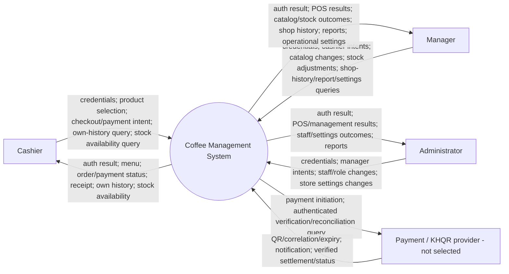

# Context diagram

Target system, **mostly planned**. Only staff authentication/current-user/logout is implemented in Phase 1. Flutter and Laravel are inside the central system boundary; database tables do not appear here. No customer account or external inventory system is assumed.

Role permissions constrain the exchanges; arrows do not grant permission. Customer payment through the provider's own app is an external event outside this staff application's boundary, represented by provider status/notification. Manager/admin can also act as cashier. The same exchanges are balanced in [DFD level 1](dfd-level-1.md). Provider arrows describe future contracts only; no external service is contacted by this milestone.
