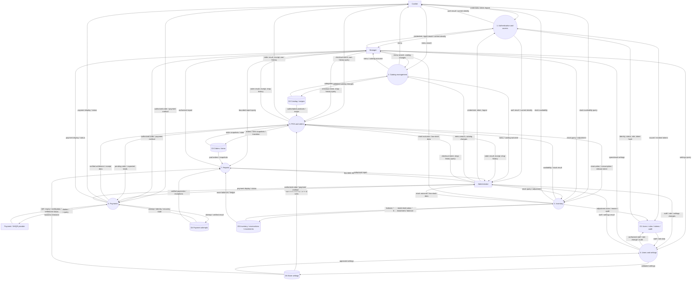

# DFD level 1

Target logical decomposition. Data stores are conceptual groups, not new databases/services. P1 has implemented backend foundations; P2 Category/Product management and reads are implemented. P3 checkout/history and P4 cash settlement/payment records are implemented, with provider-neutral external verification tested using a fake. Real provider traffic/callbacks, receipt printing, P6-P7 remain planned; Phase 5 implements recipes and gated inventory/reservation/consumption/manual release. Provider exchanges below describe the target boundary; the production adapter is unconfigured. Requests to protected processes carry identity established by P1; every process still authorizes its action/object.

All actor/provider exchanges from the context appear at this level. Manager/admin POS exchanges reflect their cashier capability; cashier has no settings/report/staff-management flow. Tokens are infrastructure grouped with identity. Manual stock adjustments now retain actor/reason in their append-only ledger; administrative audit remains planned; financial history is its own authoritative record. DFD relationships do not imply separate network deployments or independent transactions.
