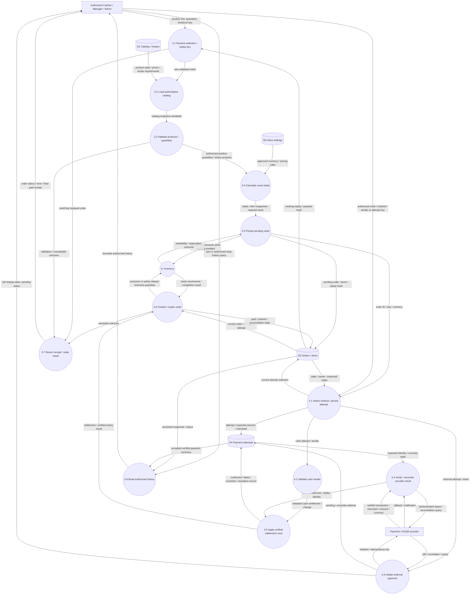

# DFD level 2: POS order + checkout + payment

Phase 3 implements 3.1-3.5 unpaid order creation and 3.8 scoped history; Phase 5 activates P5 reservation calls only for new checkouts when the deployment gate is enabled; historical untracked orders stay untracked. Phase 4 implements cash and provider-neutral initiation/verification/accepted settlement with a test fake. Real provider/callback authenticity, paid receipt printing remain **proposed**. Phase 5 local inventory completion/manual cancellation are implemented. The diagram includes target real-provider/callback/receipt/expiry exchanges; local payment/stock transactions and manual cancellation are implemented. This decomposes the combined P3/P4 boundary from level 1; P5 remains the inventory collaborator. External inputs/outputs preserve checkout, payment selection, history, receipts and provider exchanges. P2 catalog browsing precedes cart submission and is not repeated here.

## Integrity and failure interpretation

- 3.2-3.5 form one local checkout transaction; tracking off keeps the no-stock path. Shared locks cover product PKs ascending then their actual category PKs ascending; authoritative snapshots are persisted atomically. Tracking on aggregates current recipe requirements, locks inventory ascending and atomically snapshots/reserves. Catalog and stock are revalidated inside locks; any invalidity rolls back the order/reservation. The cart and client prechecks are not trusted.
- 4.1 persists attempt before external I/O; 4.3 never holds SQL locks during provider requests. Remote timeout/crash leaves a recoverable initiated/uncertain record. The QR is display data only.
- 4.4 authenticates according to the actual provider contract or treats callbacks as hints and verifies by server query. Match amount/currency/merchant/correlation/unique transaction before settlement.
- 4.5 + 3.6 now share one local acceptance/stock-consumption transaction for tracked orders; untracked orders have no stock effects. Same verified result is idempotent; second settlement/mismatch is quarantined for reconciliation. A provider success can require manual recovery if local commit fails.
- Safe manual cancellation releases reservations only after uncertainty is resolved; no automatic expiry is implemented. Late payment after release records funds plus reconciliation requirement without silently finalizing a cancelled order or overselling stock.
- History is read-only and scoped by actor/policy. Pending status returns no paid receipt. Bounded recovery scan/worker uses persisted attempts after restart; synchronous queues and client polling are insufficient crash recovery.

See [TRD](trd.md) for exact transaction/lock order and [business rules](business-rules.md) for proposed states. Tax/discount/options remain decision gates, not invented behaviors.
