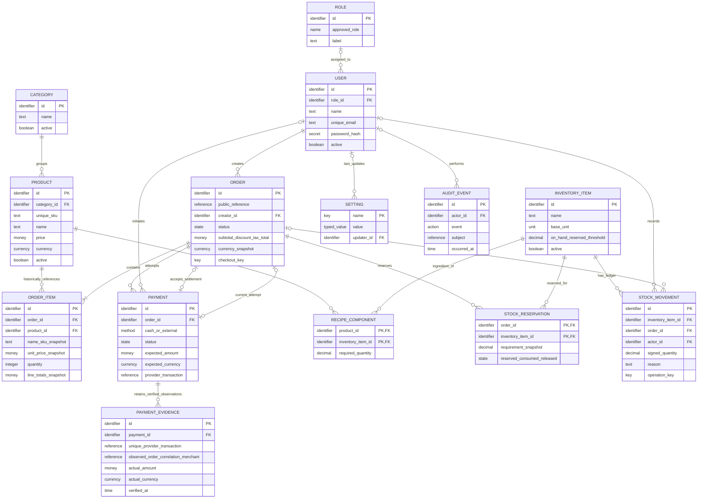

# Conceptual / logical entity relationship diagram

Roles and staff identity were implemented in Phase 1; Category and Product are implemented in Phase 2. Order and OrderItem are implemented in Phase 3 for unpaid checkout. Phase 4 implements Payment attempts, order payment selection and immutable PaymentEvidence observations. Inventory/settings/audit remain **proposed**, derived from the requirements. This ERD expresses business relationships; [TRD](trd.md) defines physical types, FKs and indexes.

## Decisions and optionality

- A role can have zero staff; a staff account can be unassigned during provisioning. Active operational access requires exactly one recognized role. No many-to-many role/permission tables are needed for three fixed roles.
- Every order has one retained staff creator and one or more items. Product/category/user references are retained with RESTRICT, while active flags retire them. Financial history has no cascade deletion. Required one-or-more items is enforced by checkout transaction, not a simple FK.
- Order-to-payment attempts is one-to-many. The order's nullable accepted_payment_id and active_payment_id each select at most one of its attempts; one attempt can only settle its own order. Thus optional one-to-one selection coexists with the attempt history. TRD explains the cross-reference constraints.
- Products and inventory items have a many-to-many relationship through recipe components. Recipes are justified for drinks and packaged stock; options, suppliers and purchase-order entities await concrete requirements.
- Order/stock-item reservations are a many-to-many association with requirement snapshots, needed to preserve availability while external payment is pending. They are not customer carts.
- Stock movements may have an order for a sale or no order for deliveries/waste/adjustment; the actor can be null for a trusted system operation, accompanied by an operation reference/reason. Settings and audit system actions have optional actors.
- Audit events are proposed for sensitive administrative changes. They supplement finance/stock records and contain allow-listed metadata, not a generic raw-request log.
- Settings have a unique key and typed approved value. Credentials are deliberately excluded. Framework token/reset/session/cache/job tables are infrastructure, not conceptual business entities; the TRD records their actual status separately.

The operational catalog, role, recipe and stock entities are normalized toward 3NF. Order snapshots intentionally duplicate historical product facts; persisted order aggregates and stock balances are deliberate derived data maintained transactionally and reconciled. No customer, store/tenant, loyalty, printer or delivery table is inferred.
