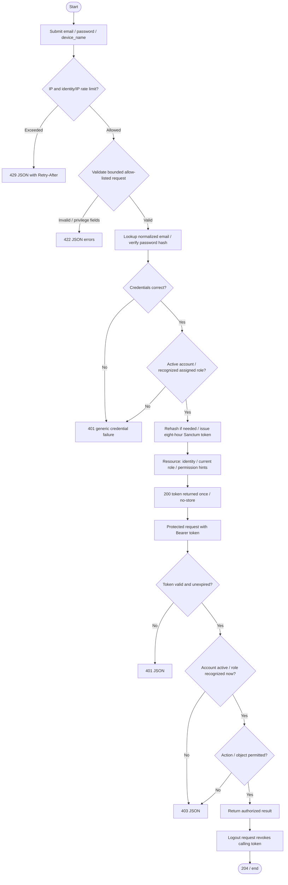
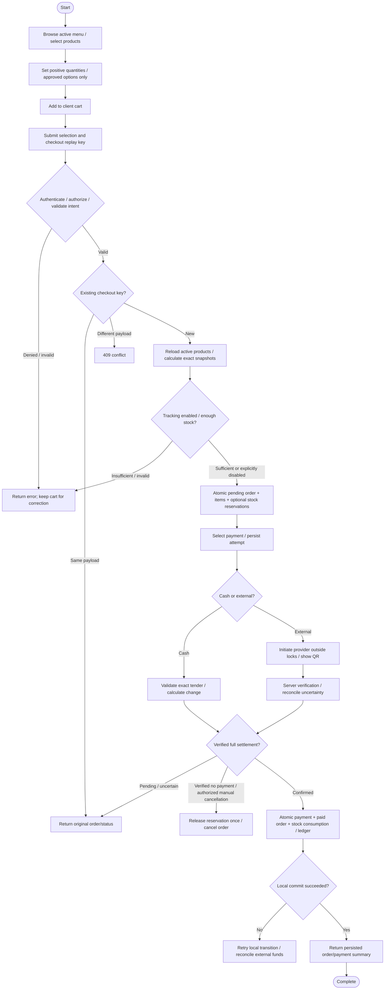
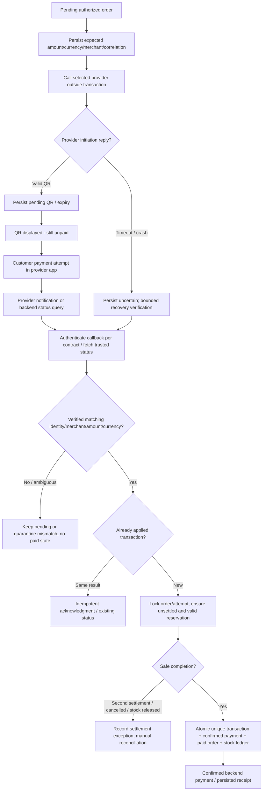
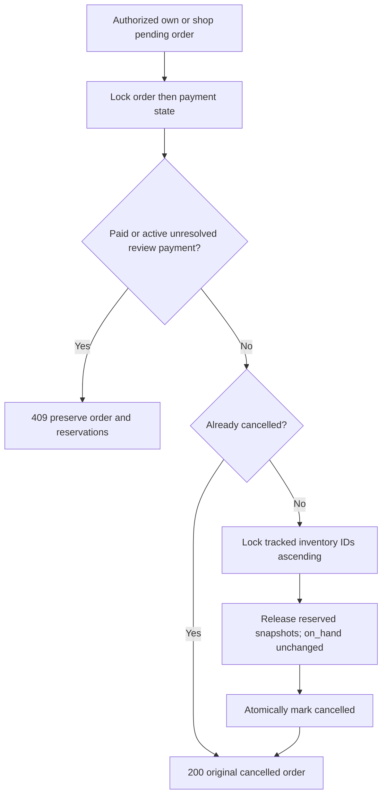

# Workflow flowcharts

Authentication below reflects implemented backend behavior. Unpaid cart validation/calculation/order creation is implemented in Phase 3; Cash/payment attempt/verified acceptance branches now have Phase 4 implementations, with fake-only provider evidence. Phase 5 implements gated stock reservation, shared consumption and manual release. Real KHQR and receipt-printing branches remain proposed; no automatic expiry. No Flutter screens are implemented here.

## Staff authentication

Malformed login attempts also count against the IP/identity limits. Successful login does not reset them. Current-user retrieves only the caller; logout does not revoke other device tokens. An inactive account cannot use protected APIs even if a previously issued token still exists.

## POS checkout and gated stock completion

No paid-order editing, split payments or refunds are implied. Options require a future approved model. Failed local checkout leaves no partial order/stock state. External funds already received are reconciled if local completion cannot commit.

## Generic payment / KHQR (planned)

Signatures, status names, polling intervals and expiry semantics come from the eventual provider contract. QR hashes are correlation values, not proof or authentication. Failed/expired results require verified no-settlement before releasing stock. Provider-neutral verification/manual recovery are fake-tested; real network verification and durable recovery workers remain unimplemented.

## Safe manual cancellation (Phase 5)

No automatic reservation timeout is implied. A late trusted provider success records funds/review without paying the cancelled order or consuming released stock.
