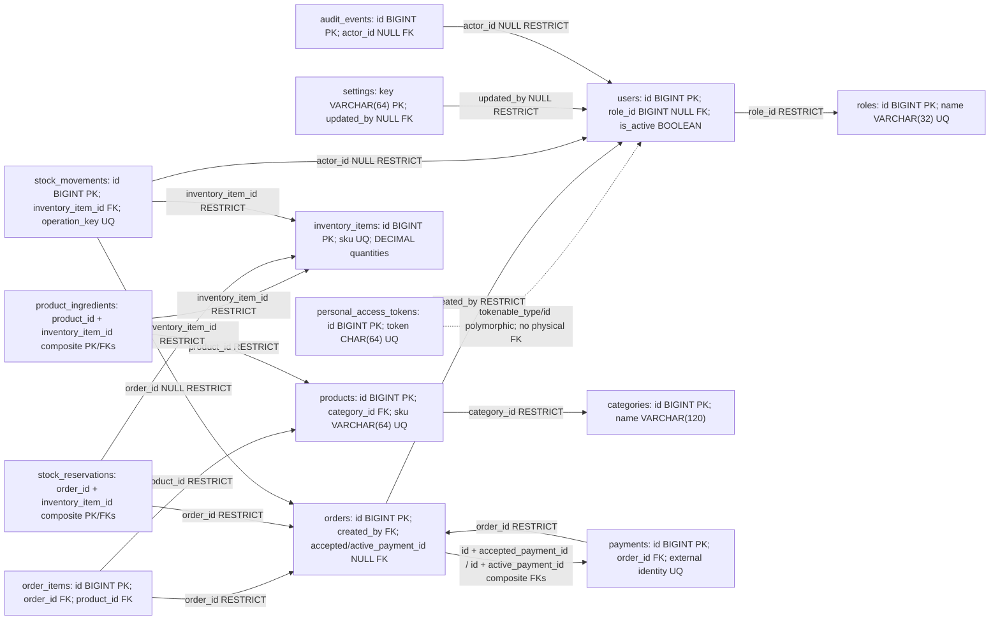

# TRD: Table Relationship Diagram

This physical design is derived from the [conceptual ERD](erd.md). **Phase 1 added roles, user access columns and personal_access_tokens; Phase 2 adds categories/products.** Other business tables/constraints remain proposed; their migrations do not exist. Infrastructure users/password reset/sessions/cache/jobs migrations already existed.

## Physical relationships

Arrows point from referencing table to referenced table. Dotted token relationship is application-enforced, not an FK. For the two payment-selection FKs create orders first without those constraints, create payments, then add `(orders.id, orders.accepted_payment_id)` / `(orders.id, orders.active_payment_id)` -> `(payments.order_id, payments.id)`; nullable payment IDs permit initial order insertion. Index both child pairs. This prevents selecting another order's payment; confirmation still enforces status/amount/currency. Down migrations must remove circular FKs before either table and must not be run against retained financial data.

## Type and lifecycle conventions

InnoDB, utf8mb4 / utf8mb4_unicode_ci for text, unsigned BIGINT auto-increment IDs/FKs unless noted, UTC TIMESTAMP created_at/updated_at for mutable records (both nullable where Laravel timestamps are used). Append-only records use created_at, not mutation timestamps. Nullable columns are explicitly marked below; all other columns NOT NULL. IDs/references never contain credentials. Soft deletes are not proposed: active flags retire staff/catalog/stock, and ledger/history are retained. Query ordering always includes an ID tie-breaker. Unique machine keys and payload hashes should use ASCII/binary collation where case-sensitive identity matters.

### Implemented Phase 1 / existing dictionary

| Table | Columns, keys and behavior |
| --- | --- |
| roles (new) | id BIGINT UNSIGNED PK; name VARCHAR(32) UQ; label VARCHAR(64); created_at/updated_at TIMESTAMP NULL. Standard cashier/manager/admin via idempotent seeder; roles never accept client writes |
| users (existing + new access columns) | id BIGINT UNSIGNED PK; name/email VARCHAR(255), email UQ; password VARCHAR(255); email_verified_at TIMESTAMP NULL; remember_token VARCHAR(100) NULL; timestamps NULL; new role_id BIGINT UNSIGNED NULL FK roles.id RESTRICT; new is_active BOOLEAN DEFAULT false. Single role, fail-closed unassigned legacy/new accounts |
| personal_access_tokens (new, Sanctum format) | id BIGINT UNSIGNED PK; tokenable_type VARCHAR(255), tokenable_id BIGINT UNSIGNED, composite polymorphic index; name TEXT; token VARCHAR(64) UQ (SHA-256); abilities TEXT NULL; last_used_at/expires_at TIMESTAMP NULL, expires_at index; timestamps NULL. App issues eight-hour expiry and staff ability; no user FK in Sanctum's standard polymorphic schema |
| password_reset_tokens (existing) | email VARCHAR(255) PK; token VARCHAR(255); created_at TIMESTAMP NULL. No password-reset endpoint implemented |
| sessions (existing) | id VARCHAR(255) PK; user_id BIGINT UNSIGNED NULL index; ip_address VARCHAR(45) NULL; user_agent TEXT NULL; payload LONGTEXT; last_activity INT index. No staff cookie-session flow implemented; local session driver is file |
| cache / cache_locks / jobs / job_batches / failed_jobs (existing) | Framework cache/queue infrastructure; existing migrations remain unchanged. Default cache=file, queue=sync, so these are not a durable payment worker |

Email lookup uses the existing unique index. Trusted future provisioning normalizes lowercase/trimmed email to match LoginRequest; MySQL collation must be considered for Unicode/address equality. Role assignment is nullable to preserve legacy rows without guessing privileges. No active-role index is needed for current-user/login by PK/email; FK index covers role_id.

### Implemented catalog / proposed order and payment dictionary

| Table | Important columns, constraints and purpose |
| --- | --- |
| categories (implemented) | id PK; name VARCHAR(120); is_active BOOLEAN DEFAULT true; timestamps. Index `(is_active, name, id)` for active category browse. Name uniqueness is not assumed without owner approval |
| products (implemented) | id PK; category_id FK RESTRICT; sku VARCHAR(64) case-insensitive UQ (canonical uppercase ASCII API); name VARCHAR(160); description TEXT NULL (API max 2000); price_minor signed BIGINT; currency CHAR(3) case-sensitive utf8mb4_bin; is_active BOOLEAN DEFAULT true; timestamps. MySQL CHECK price_minor BETWEEN 0 AND 999999 and currency='USD'. API money is a canonical cent string. Index `(category_id, is_active, name, id)` for category-filtered menu plus `(is_active, name, id)` for unfiltered menu; both verified by EXPLAIN on synthetic shop-scale data. Literal bounded name/SKU substring search; measure before FULLTEXT |
| orders | id PK; public_reference VARCHAR(40) UQ; created_by FK users RESTRICT; status VARCHAR(24); currency CHAR(3); subtotal_minor/discount_minor/tax_minor/total_minor BIGINT; checkout_key VARCHAR(64); request_hash CHAR(64); accepted_payment_id/active_payment_id BIGINT UNSIGNED NULL; inventory_tracked BOOLEAN; expires_at/paid_at TIMESTAMP NULL; timestamps. UQ `(created_by, checkout_key)`; composite FKs described above; unique accepted_payment_id/active_payment_id; CHECK all amounts>=0, discount<=subtotal, total=subtotal-discount+tax. Indices `(created_by, created_at, id)`, `(status, created_at, id)`; `(status, expires_at, id)` for recovery. Paid-order selected-payment consistency enforced transactionally |
| order_items | id PK; order_id FK RESTRICT; line_number SMALLINT UNSIGNED; product_id FK RESTRICT; product_name VARCHAR(160), product_sku VARCHAR(64); unit_price_minor BIGINT; quantity SMALLINT UNSIGNED; subtotal_minor/discount_minor/tax_minor/line_total_minor BIGINT. UQ `(order_id, line_number)`; CHECK quantity>0, price/amounts>=0, subtotal=unit_price*quantity, discount<=subtotal, line_total=subtotal-discount+tax. Order snapshots immutable; currency inherited from parent |
| payments | id PK; order_id FK RESTRICT; attempt_key VARCHAR(64); method VARCHAR(16); status VARCHAR(24); provider VARCHAR(64) NULL; external_transaction_id VARCHAR(191) NULL binary; correlation_reference VARCHAR(191) NULL; expected_amount_minor BIGINT; currency CHAR(3); merchant_reference VARCHAR(191) NULL; tender_minor/change_minor BIGINT NULL; reconciliation_required BOOLEAN DEFAULT false; expires_at/verified_at TIMESTAMP NULL; timestamps. UQ `(order_id, attempt_key)`, UQ `(provider, external_transaction_id)`, UQ `(order_id,id)` for reverse FKs. CHECK amount>=0; cash tender/change relation validated; external confirmed identity/merchant mandatory via state transition. Index `(status, updated_at, id)` for retry/reconciliation; `(verified_at,id)` for bounded reports |

MySQL permits multiple NULLs in unique indexes: before provider identity is known, uniqueness does not guarantee settlement safety. Transition code must require non-null provider/external_transaction_id for confirmed external settlement. An order's accepted_payment_id enforces one accepted attempt; it does **not** prevent an external provider from receiving a second payment, which remains a reconciliation record. All monetary APIs return exact strings, and business input caps avoid BIGINT/product multiplication overflow.

### Proposed inventory / settings / audit dictionary

| Table | Important columns, constraints and purpose |
| --- | --- |
| inventory_items | id PK; sku VARCHAR(64) UQ; name VARCHAR(160); base_unit VARCHAR(16); on_hand/reserved/reorder_level DECIMAL(14,4) DEFAULT 0; is_active BOOLEAN; timestamps. CHECK on_hand>=0, reserved>=0, reserved<=on_hand, reorder_level>=0. Units explicitly approved; no FLOAT. Scan low-stock initially at shop scale; measure before materialized flags |
| product_ingredients | product_id + inventory_item_id composite PK and FKs RESTRICT; quantity DECIMAL(14,4) CHECK >0; timestamps. Reverse inventory_item_id FK/index supports impact lookup. One row per ingredient/product; no speculative recipe version table |
| stock_reservations | order_id + inventory_item_id composite PK and FKs RESTRICT; quantity DECIMAL(14,4) CHECK >0; status VARCHAR(16) (reserved/consumed/released); timestamps. Index `(status, order_id)` for recovery; requirements captured at checkout rather than rereading recipe on settlement |
| stock_movements | id PK; inventory_item_id FK RESTRICT; order_id BIGINT UNSIGNED NULL FK RESTRICT; actor_id BIGINT UNSIGNED NULL FK RESTRICT; quantity_delta DECIMAL(14,4) CHECK !=0; reason VARCHAR(32); note VARCHAR(255) NULL; operation_key VARCHAR(128) UQ; created_at TIMESTAMP. `(inventory_item_id,created_at,id)` ledger browsing; `(order_id,inventory_item_id)` sale lookup. Operation key e.g. `sale:order-id:item-id`; system reason/source explicit; corrections append entries |
| settings | key VARCHAR(64) PK; value JSON; updated_by BIGINT UNSIGNED NULL FK users RESTRICT; timestamps. Key allow-list and typed value validated by application. No secrets, no arbitrary schema-free writes; supported settings approved in Phase 6 |
| audit_events | id PK; actor_id BIGINT UNSIGNED NULL FK users RESTRICT; action VARCHAR(64); subject_type VARCHAR(64); subject_id BIGINT UNSIGNED NULL; metadata JSON NULL (allow-listed); created_at TIMESTAMP. `(subject_type,subject_id,created_at,id)` and `(actor_id,created_at,id)` queries. Polymorphic subject deliberately not an FK; no sensitive raw payloads |

Proposed business migrations additionally CHECK allowed order, attempt, method and reservation status values from the business rules. Cross-row sums, accepted-payment terminal state and amount/currency/merchant matching remain transaction-code invariants; simple CHECK expressions cannot enforce them. Inventory tracked orders require reservations before becoming paid.

Phase 2 now requires **MySQL >=8.0.16** for enforced product CHECKs; the Product migration rejects older MySQL before creating its table. SQLite tests mirror columns/FKs/unique indexes but omit those MySQL CHECKs; four direct invalid-money tests execute only on MySQL. State/decimal/locking constraints for future business tables still need their own isolated MySQL verification. Primary/FK/unique indexes already serving a query should not be duplicated.

## Transactions and concurrency (proposed)

1. **Checkout:** authenticate/authorize; canonicalize validated intent; lock selected catalog/recipe rows in deterministic order so concurrent edits cannot produce mixed snapshots; reject inactive/mixed currency/unsupported price fields; lock stock by ascending ID if tracking enabled; calculate exact snapshots; insert order/items/reservations and update reserved balances in one transaction. Unique actor/key handles concurrent replay; same hash returns prior order, changed hash conflicts. No remote I/O. Lock order globally: catalog/recipes when needed -> order -> payment -> sorted stock; workflows that start with an existing order never acquire catalog locks later.
2. **Cash completion:** lock order -> attempt -> sorted stock. Check authorized owner/current state, no accepted settlement, expected totals and tender. Confirm cash payment, select accepted attempt, mark paid, consume reservations, append unique sale movements/update balances together. Tracking disabled means no stock writes; do not pretend these sales had enforced availability.
3. **External initiation:** persist attempt/correlation/intent and choose current attempt under order lock; commit; call provider with supported replay key outside transaction; persist validated reply in a new short transaction. A crash/timeout leaves initiated/uncertain attempt recoverable; do not open another active attempt until verification establishes outcome.
4. **External confirmation:** verify callback or authenticated status I/O first; transaction locks order -> attempt -> sorted stock. Insert/check provider-scoped identity; verify exact amount/currency/merchant/correlation and unsettled state; atomically confirm/select paid order, consume reservations, append movements. Same terminal result is a no-op; mismatches/second settlements become explicit reconciliation exceptions. Provider settlement evidence is retained even if order cannot be finalized.
5. **Expiry/cancel:** provider verification outside locks establishes no settlement or quarantine. Transaction checks current order/attempt, releases each still-reserved quantity once, marks expired/cancelled. Race with confirmation serializes on order; late success after release never silently deducts unavailable stock or reverses cancellation.
6. **Adjustment:** gate manager/admin; lock stock item(s) sorted; validate signed delta and on_hand>=reserved; append unique adjustment movement, update on_hand, append audit event and commit. Replay key prevents duplicate correction.

Bound deadlock retries (proposed three) only around repeatable local transactions. Unique-key races are handled by fetching/comparing the existing intent/transition; never turn a uniqueness failure into a second sale. No lock spans HTTP/provider I/O. Stock and payment failures roll back local completion together; external funds cannot be rolled back by a SQL transaction and require reconciliation.

## Rollout

Phase 1 adds new migrations rather than rewriting old ones. Run migrations on a verified dedicated environment, then idempotent role seeding; provision accounts through a trusted process. Existing users retain identity/passwords but remain unassigned/inactive. Future stock rollout needs initial auditable opening-balance movements, recipes, reconciliation and a cutover with no unresolved untracked orders. Phase 2 migration upgrade was verified with existing active staff/role/token rows retained. Catalog APIs never expose DELETE; retirement/reactivation uses is_active. Back up and review destructive down migrations; fresh SQLite tests are not proof of MySQL locks/collations or a deployed migration path.
