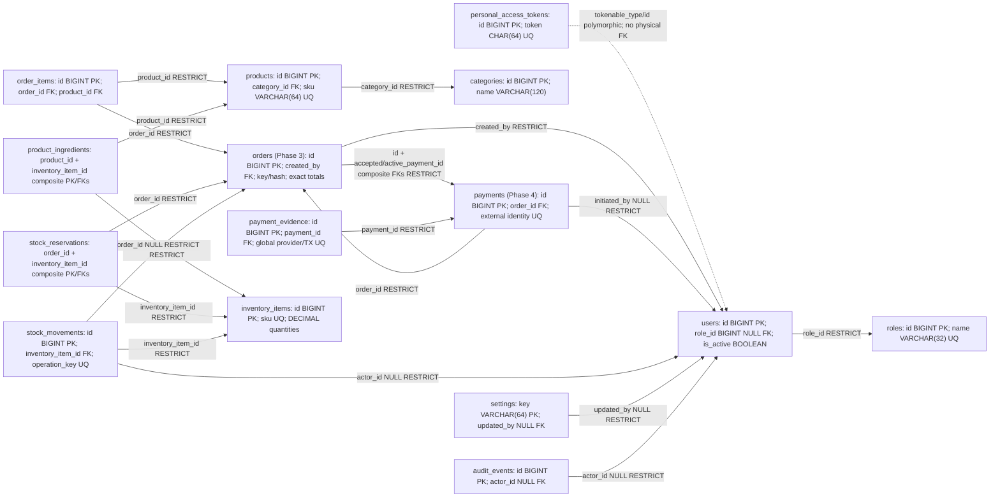

# TRD: Table Relationship Diagram

This physical design is derived from the [conceptual ERD](erd.md). **Phase 1 added roles, user access columns and personal_access_tokens; Phase 2 adds categories/products; Phase 3 adds orders/order_items; Phase 4 adds payments/payment_evidence and owning-order accepted/active selection.** Phase 5 adds inventory_items, product_ingredients, stock_reservations and stock_movements. Settings/admin audit remain proposed; their migrations do not exist. Infrastructure users/password reset/sessions/cache/jobs migrations already existed.

## Physical relationships

Arrows point from referencing table to referenced table; order/payment-selection FKs are now implemented through an additive Phase 4 migration; stock edges are implemented in Phase 5; settings/audit edges remain proposed. Dotted token relationship is application-enforced, not an FK. For the two payment-selection FKs create orders first without those constraints, create payments, then add `(orders.id, orders.accepted_payment_id)` / `(orders.id, orders.active_payment_id)` -> `(payments.order_id, payments.id)`; nullable payment IDs permit initial order insertion. Index both child pairs. This prevents selecting another order's payment; confirmation still enforces status/amount/currency. Down migrations must remove circular FKs before either table and must not be run against retained financial data.

## Type and lifecycle conventions

InnoDB, utf8mb4 / utf8mb4_unicode_ci for text, unsigned BIGINT auto-increment IDs/FKs unless noted, UTC TIMESTAMP created_at/updated_at for mutable records (both nullable where Laravel timestamps are used). Append-only records use created_at, not mutation timestamps. Nullable columns are explicitly marked below; all other columns NOT NULL. IDs/references never contain credentials. Soft deletes are not proposed: active flags retire staff/catalog/stock, and ledger/history are retained. Query ordering always includes an ID tie-breaker. Unique machine keys and payload hashes should use ASCII/binary collation where case-sensitive identity matters.

### Implemented Phase 1 / existing dictionary

| Table | Columns, keys and behavior |
| --- | --- |
| roles (new) | id BIGINT UNSIGNED PK; name VARCHAR(32) UQ; label VARCHAR(64); created_at/updated_at TIMESTAMP NULL. Standard cashier/manager/admin via idempotent seeder; roles never accept client writes |
| users (existing + new access columns) | id BIGINT UNSIGNED PK; name/email VARCHAR(255), email UQ; password VARCHAR(255); email_verified_at TIMESTAMP NULL; remember_token VARCHAR(100) NULL; timestamps NULL; new role_id BIGINT UNSIGNED NULL FK roles.id RESTRICT; new is_active BOOLEAN DEFAULT false. Single role, fail-closed unassigned legacy/new accounts |
| personal_access_tokens (new, Sanctum format) | id BIGINT UNSIGNED PK; tokenable_type VARCHAR(255), tokenable_id BIGINT UNSIGNED, composite polymorphic index; name TEXT; token VARCHAR(64) UQ (SHA-256); abilities TEXT NULL; last_used_at/expires_at TIMESTAMP NULL, expires_at index; timestamps NULL. App issues eight-hour expiry and staff ability; no user FK in Sanctum's standard polymorphic schema |
| password_reset_tokens (existing) | email VARCHAR(255) PK; token VARCHAR(255); created_at TIMESTAMP NULL. No password-reset endpoint implemented |
| sessions (existing) | id VARCHAR(255) PK; user_id BIGINT UNSIGNED NULL index; ip_address VARCHAR(45) NULL; user_agent TEXT NULL; payload LONGTEXT; last_activity INT index. No staff cookie-session flow implemented; local session driver is file |
| cache / cache_locks / jobs / job_batches / failed_jobs (existing) | Framework cache/queue infrastructure; existing migrations remain unchanged. Default cache=file, queue=sync, so these are not a durable payment worker |

Email lookup uses the existing unique index. Trusted future provisioning normalizes lowercase/trimmed email to match LoginRequest; MySQL collation must be considered for Unicode/address equality. Role assignment is nullable to preserve legacy rows without guessing privileges. No active-role index is needed for current-user/login by PK/email; FK index covers role_id.

### Implemented catalog/orders/payments dictionary

| Table | Important columns, constraints and purpose |
| --- | --- |
| categories (implemented) | id PK; name VARCHAR(120); is_active BOOLEAN DEFAULT true; timestamps. Index `(is_active, name, id)` for active category browse. Name uniqueness is not assumed without owner approval |
| products (implemented) | id PK; category_id FK RESTRICT; sku VARCHAR(64) case-insensitive UQ (canonical uppercase ASCII API); name VARCHAR(160); description TEXT NULL (API max 2000); price_minor signed BIGINT; currency CHAR(3) case-sensitive utf8mb4_bin; is_active BOOLEAN DEFAULT true; timestamps. MySQL CHECK price_minor BETWEEN 0 AND 999999 and currency='USD'. API money is a canonical cent string. Index `(category_id, is_active, name, id)` for category-filtered menu plus `(is_active, name, id)` for unfiltered menu; both verified by EXPLAIN on synthetic shop-scale data. Literal bounded name/SKU substring search; measure before FULLTEXT |
| orders (implemented) | id BIGINT UNSIGNED PK; public_reference VARCHAR(40) case-sensitive UQ (ORD-ULID); created_by BIGINT UNSIGNED FK users RESTRICT; status VARCHAR(24) default pending_payment; currency CHAR(3); subtotal_minor/discount_minor/tax_minor/total_minor signed BIGINT; checkout_key VARCHAR(64), request_hash CHAR(64), case-sensitive utf8mb4_bin; inventory_tracked BOOLEAN default false; nullable framework timestamps. UQ `(created_by, checkout_key)`; CHECK status IN pending_payment/paid/cancelled/expired, currency USD, subtotal 0-4949995050, discount/tax zero, total=subtotal, inventory flag 0/1. Indices `(created_by, created_at, id)`, `(created_at,id)`, `(status,created_at,id)` serve own/shop/filtered history and were verified with EXPLAIN. Phase 4 adds accepted_payment_id/active_payment_id BIGINT UNSIGNED NULL UQ, paid_at TIMESTAMP NULL, `(id,selection_id)` indices/composite FKs to payments(order_id,id). CHECK paid=>accepted/paid_at nonnull and active null; non-paid=>accepted/paid_at null. No order expiry field |
| order_items (implemented) | id BIGINT UNSIGNED PK; order_id/product_id BIGINT UNSIGNED FKs RESTRICT; line_number SMALLINT UNSIGNED; product_name VARCHAR(160), product_sku VARCHAR(64) snapshots; unit_price_minor signed BIGINT; quantity SMALLINT UNSIGNED; subtotal_minor/discount_minor/tax_minor/line_total_minor signed BIGINT. UQ `(order_id,line_number)` and `(order_id,product_id)`; CHECK quantity 1-99, line 1-50, unit price 0-999999, subtotal=unit_price*quantity, discount/tax zero, line_total=subtotal. No item timestamps; immutable rows inherit parent creation time/currency. Cross-row sum and at-least-one item enforced by checkout transaction |
| payments (implemented) | id BIGINT UNSIGNED PK; order_id FK RESTRICT; initiated_by BIGINT UNSIGNED NULL FK users RESTRICT (server derived for runtime operations); attempt_key/request_hash VARCHAR(64) case-sensitive; method VARCHAR(16); status VARCHAR(24); provider VARCHAR(64) NULL, external_transaction_id/correlation_reference/merchant_reference VARCHAR(191) NULL, utf8mb4_bin; expected_amount_minor signed BIGINT 0-4949995050; currency CHAR(3) USD; tender_minor/change_minor signed BIGINT NULL; reconciliation_required BOOLEAN default false, reconciliation_reason VARCHAR(64) NULL; qr_payload TEXT NULL (app max 8192 bytes); expires_at/verified_at TIMESTAMP NULL; timestamps. UQ `(order_id,attempt_key)`, `(provider,external_transaction_id)`, `(provider,correlation_reference)`, `(order_id,id)`. CHECK allowed method/states, USD amount, cash exact tender/change up to 9999999999 or external null tender/change, confirmed=>verified_at and external identity/context nonnull. Indices `(status,updated_at,id)`, `(reconciliation_required,updated_at,id)` for recovery/review, EXPLAIN verified |
| payment_evidence (implemented) | id BIGINT UNSIGNED PK; payment_id FK RESTRICT; provider VARCHAR(64), external_transaction_id/correlation_reference/merchant_reference VARCHAR(191), order_reference VARCHAR(40), case-sensitive; amount_minor signed BIGINT >=0; currency CHAR(3); verified_at/created_at TIMESTAMP nonnull. UQ `(provider,external_transaction_id)` globally prevents crediting one observation twice; append-only normalized facts retain mismatch/extra received transactions. No credentials/raw signed payload. Observations are not automatically accepted sales |

MySQL permits multiple NULLs in unique indexes: before provider identity is known, uniqueness does not guarantee settlement safety. Transition code must require non-null provider/external_transaction_id for confirmed external settlement. An order's accepted_payment_id enforces one accepted attempt; it does **not** prevent an external provider from receiving a second payment, which remains a reconciliation record. All monetary APIs return exact strings, and business input caps avoid BIGINT/product multiplication overflow.

### Implemented Phase 5 inventory / proposed settings and audit dictionary

| Table | Important columns, constraints and purpose |
| --- | --- |
| inventory_items (implemented) | id BIGINT UNSIGNED PK; sku VARCHAR(64) case-insensitive UQ; name VARCHAR(160); base_unit VARCHAR(8) binary g/ml/unit; on_hand/reserved/reorder_level DECIMAL(14,4) DEFAULT 0; is_active BOOLEAN; timestamps. CHECK on_hand>=0, reserved>=0, reserved<=on_hand, reorder_level>=0 and allowed units. Indices (is_active,name,id), (name,id). No unit conversions or FLOAT; unit immutable. Low stock available<=reorder uses a residual expression, not a materialized flag |
| product_ingredients (implemented) | product_id + inventory_item_id BIGINT UNSIGNED composite PK and FKs RESTRICT; quantity DECIMAL(14,4) CHECK >0. No version/timestamp columns; full replacement locks parent product exclusively and active stock shared in ascending ID order. Checkout holds product shared and uses current locking recipe reads; snapshots live in reservations |
| stock_reservations (implemented) | order_id + inventory_item_id BIGINT UNSIGNED composite PK, FKs RESTRICT; quantity DECIMAL(14,4) CHECK >0; binary status VARCHAR(16) CHECK reserved/consumed/released; timestamps. Index (inventory_item_id,status,order_id) for item reconciliation. Quantities/order/item immutable; transaction-only terminal transition, no deletion |
| stock_movements (implemented) | id BIGINT UNSIGNED PK; inventory_item_id FK RESTRICT; order_id/actor_id nullable FKs RESTRICT; quantity_delta signed DECIMAL(14,4); binary reason VARCHAR(24), operation_key VARCHAR(100) UQ, attempt_key VARCHAR(64) nullable, request_hash VARCHAR(64) nullable; note VARCHAR(500) nullable; created_at TIMESTAMP, no updated_at. UQ (actor_id,attempt_key); indices (inventory_item_id,created_at,id), (order_id,inventory_item_id). CHECK allowed reasons/signs/adjustment note and sale order/nonmanual origin versus manual actor/key/hash. Deterministic sale:order:item; manual identity hash; append-only |
| settings | key VARCHAR(64) PK; value JSON; updated_by BIGINT UNSIGNED NULL FK users RESTRICT; timestamps. Key allow-list and typed value validated by application. No secrets, no arbitrary schema-free writes; supported settings approved in Phase 6 |
| audit_events | id PK; actor_id BIGINT UNSIGNED NULL FK users RESTRICT; action VARCHAR(64); subject_type VARCHAR(64); subject_id BIGINT UNSIGNED NULL; metadata JSON NULL (allow-listed); created_at TIMESTAMP. `(subject_type,subject_id,created_at,id)` and `(actor_id,created_at,id)` queries. Polymorphic subject deliberately not an FK; no sensitive raw payloads |

Implemented inventory/payment migrations CHECK allowed order, attempt, method and reservation status values from the business rules. Cross-row sums, accepted-payment terminal state and amount/currency/merchant matching remain transaction-code invariants; simple CHECK expressions cannot enforce them. Inventory tracked orders require reservations before becoming paid.

Phase 2 now requires **MySQL >=8.0.16** for enforced product CHECKs; the Product migration rejects older MySQL before creating its table. SQLite tests mirror columns/FKs/unique indexes but omit those MySQL CHECKs; four direct invalid-money tests execute only on MySQL. Order/order-item CHECKs, UTC epochs, idempotency uniqueness and shared catalog locks are now verified on isolated MySQL; SQLite skips these production-specific guarantees. Payment/stock/DECIMAL constraints and concurrency were verified separately in Phases 4-5; see their verification reports. Primary/FK/unique indexes already serving a query should not be duplicated.

## Transactions and concurrency (Phases 3-5 implemented)

1. **Checkout (Phase 5 gated):** authenticate/authorize and canonical replay first. Shared product PK locks ascending, then actual category PKs ascending, revalidate authoritative cents/snapshots. Tracking off preserves Phase 3. Tracking on uses current shared-lock recipe reads (parent product protects whole replacement), aggregates checked quantities, locks inventory IDs ascending and validates active/available. Persist immutable tracking flag, order/items and reservation snapshots, increment reserved atomically. No provider I/O. Three bounded retries; unique checkout winner reread occurs after rollback so changed catalog/recipe state cannot hide a committed replay.
2. **Cash completion (Phase 5 shared finalization):** order -> payment -> sorted inventory -> reservation transitions. Confirm cash in the same transaction as OrderSettlementService; validate persisted confirmed owning amount/currency and no review requirement. Tracked snapshots consume reserved/on_hand, append unique sale movements and become consumed before accepting paid selection/timestamp. Untracked orders have no stock calls/writes. Any local failure rolls all effects back.
3. **External initiation (Phase 4 foundation, default provider unconfigured):** persist attempt/correlation/intent and choose current attempt under order lock; commit; call provider with supported replay key outside transaction; persist validated reply in a new short transaction. A crash/timeout leaves initiated/uncertain attempt recoverable; do not open another active attempt until verification establishes outcome.
4. **External confirmation (Phase 5 fake-tested):** trusted provider status I/O outside transactions; order -> attempt -> sorted inventory -> reservation transitions. Verify exact provider/order/amount/currency/merchant/correlation/unique transaction and retain immutable evidence. Shared finalization accepts eligible proof with tracked stock atomically; repeated results do not consume twice. Late/cancelled/additional/mismatched observations remain quarantined, never consume released stock or replace acceptance. No public callback or real bank contract implemented.
5. **Manual cancellation:** current persisted payment state must establish safety (no active/unresolved/review settlement). Trusted provider verification is separately performed outside locks when needed. Order/payment/stock transaction releases still-reserved snapshots and marks cancelled only. No automatic expiry/order-expired transition is implemented. Race with confirmation serializes on order; late success after release is quarantined.
6. **Adjustment:** gate manager/admin; lock stock item(s) sorted; validate signed delta and on_hand>=reserved; append unique adjustment movement with actor/reason/note, update on_hand and commit. Administrative audit_events is Phase 6, not implemented. Replay key prevents duplicate correction.

Bound deadlock retries to three attempts around repeatable local transactions. Unique-key races are handled by fetching/comparing the existing intent/transition; never turn a uniqueness failure into a second sale. No lock spans HTTP/provider I/O. Stock and payment failures roll back local completion together; external funds cannot be rolled back by a SQL transaction and require reconciliation.

## Rollout

Phase 1 adds new migrations rather than rewriting old ones. Run migrations on a verified dedicated environment, then idempotent role seeding; provision accounts through a trusted process. Existing users retain identity/passwords but remain unassigned/inactive. Stock rollout requires auditable opening balances, recipes and reconciliation before enabling the deployment gate. Historical pending untracked orders remain valid and settle without stock; they are never backfilled. Phase 2 migration upgrade retained active staff/role/token rows. Phase 3 upgrade from all eight Phase 2 migrations retains those plus categories/products, then successfully creates pending orders. Phase 4 now implements payment-selection composite FKs/paid_at and verified attempt/evidence rows; Phase 3 original migrations remain unchanged. Phase 5 adds stock tables with preserved prior rows. Automatic order expiry remains a later policy. Catalog APIs never expose DELETE; retirement/reactivation uses is_active. Back up and review destructive down migrations; fresh SQLite tests are not proof of MySQL locks/collations or a deployed migration path.

## Phase 5 cancellation, audit and cutover

Manual cancellation locks order -> payment state -> sorted inventory -> reservations. Pending only, same cancelled replay returns original result. Paid/accepted/active/unresolved/review attempts block release. Tracked reserved decreases and snapshots become released; on_hand stays unchanged. No release movement or automatic timeout. Deployment gate defaults false; old orders never backfill. Read-only consistent inventory:check verifies ledger balances/reserved sums/lifecycle/sale deltas and reports discrepancies without repair. Four additive migrations upgrade Phase 4; FK removal order is safe on disposable rollback tests but production down drops history and requires separate operational approval. See [Phase 5 verification](phase-5-verification.md).
